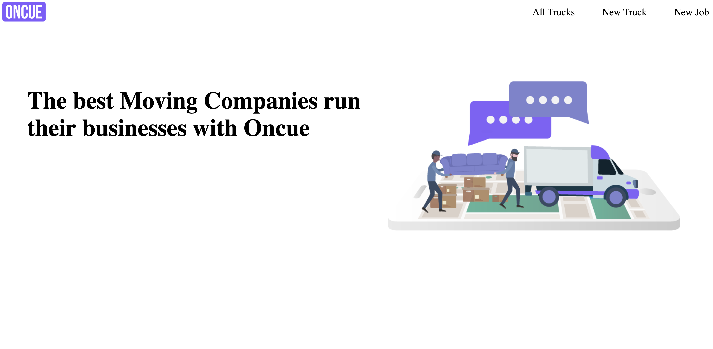

# ONCUE

Check out the [wiki](https://github.com/jlshaw117/oncue_coding_challenge/wiki) or see it [live]()

An app that allows a user to manage multiple trucks and jobs without worry of scheduling conflicts.

## Technologies

* PostgresSQL for the database
* Ruby on Rails for the backend
* React/Redux for the frontend
* CSS for styling

## Fetures

### Create Truck

A user can create a new truck with hours of operation.

### Create Job

A user can create a job that will get assigned to a truck if one is avalible during the requested time. To ensure no scheduling conflicts I used active record and Arel to compose a query that filters the trucks down to all trucks that are busy during the selected date and time. then asigns one of the trucks not on that list.

